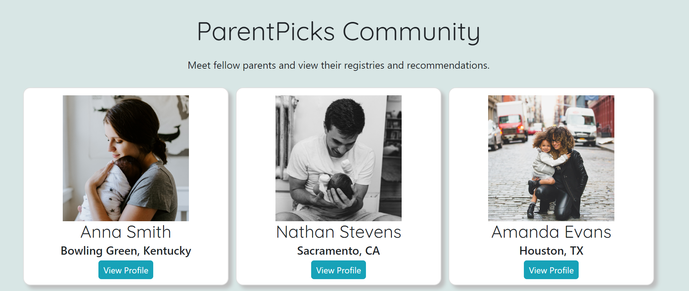

# ParentPicks

## Description
ParentPicks is an application that new parents can use to view highly recommended baby and toddler products, based on ratings and reviews from their community. Parents are then able to add the recommended products to their baby registry.

## Screenshots
### Login Page

### All Products Page

### Registry Page

### My Picks Page

### Community Page

## How to visit site
* Site has not yet been deployed.

## Installation Instructions
* Clone down this repo
* At the root of the project, run `npm install`

## How to run
* In the terminal, type `npm start` to run the webpage.
* If you want to make a production build of this project, type `npm run build`. This will create a folder called build with all of the minified code you need.

## Author
Emily Dewitt
